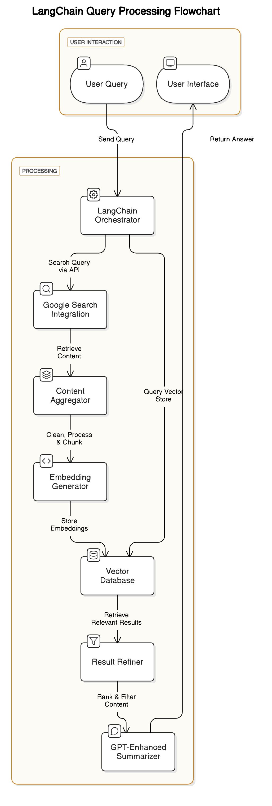

# DocsGPT 🚀

> Your Intelligent Documentation Assistant

DocsGPT is a cutting-edge documentation search and exploration tool that combines the power of LangChain and GPT technology to provide precise, context-aware answers from your documentation.



## ✨ Features

- 🔍 **Intelligent Search**: Natural language processing for intuitive documentation queries
- 🤖 **LangChain Integration**: Advanced query processing and context understanding
- 📚 **Smart Content Processing**: Efficient document aggregation and vector embeddings
- 🎯 **Precise Results**: GPT-enhanced result refinement and summarization
- 💻 **Modern UI**: Responsive React-based interface with smooth animations
- 🌐 **Cross-Platform**: Works with various documentation formats and sources

## 🏗️ Architecture


DocsGPT utilizes a sophisticated architecture consisting of:

1. **User Interface Layer**
   - React + Tailwind CSS frontend
   - Framer Motion animations
   - Responsive design

2. **API Layer**
   - FastAPI backend
   - Request handling and authentication
   - API endpoint management

3. **Processing Layer**
   - LangChain Orchestrator
   - Document processing pipeline
   - Vector embedding generation

4. **Storage Layer**
   - Vector database integration
   - Efficient document indexing
   - Fast retrieval system

## 🚀 Getting Started

### Prerequisites

- Node.js (v14 or higher)
- Python 3.8+
- pip

### Installation

1. Clone the repository:
   ```bash
   git clone https://github.com/codewitdark-git/DocsGPT.git
   cd DocsGPT
   ```

2. Install frontend dependencies:
   ```bash
   cd frontend
   npm install
   ```

3. Install backend dependencies:
   ```bash
   cd ../backend
   pip install -r requirements.txt
   ```

4. Start the development servers:
   ```bash
   # Frontend (in frontend directory)
   npm run dev

   # Backend (in backend directory)
   python main.py
   ```

## 🛠️ Development

### Frontend Structure

```
frontend/
├── src/
│   ├── components/     # React components
│   ├── assets/        # Images and static files
│   ├── styles/        # CSS and styling
│   └── App.jsx        # Main application component
```

### Key Technologies

- **Frontend**:
  - React
  - Tailwind CSS
  - Framer Motion
  - React Router

- **Backend**:
  - FastAPI
  - LangChain
  - Vector Embeddings
  - GPT Integration

## 🤝 Contributing

We welcome contributions! Please follow these steps:

1. Fork the repository
2. Create a feature branch
3. Commit your changes
4. Push to the branch
5. Submit a pull request

## 📫 Get in Touch

- GitHub: [arc53/DocsGPT](https://github.com/arc53/DocsGPT)
- Discord: [Join our community](https://discord.gg/n5BX5cqWqp)

## 📝 License

This project is licensed under the MIT License - see the [LICENSE](LICENSE) file for details.

---

Built with ❤️ by the DocsGPT team
